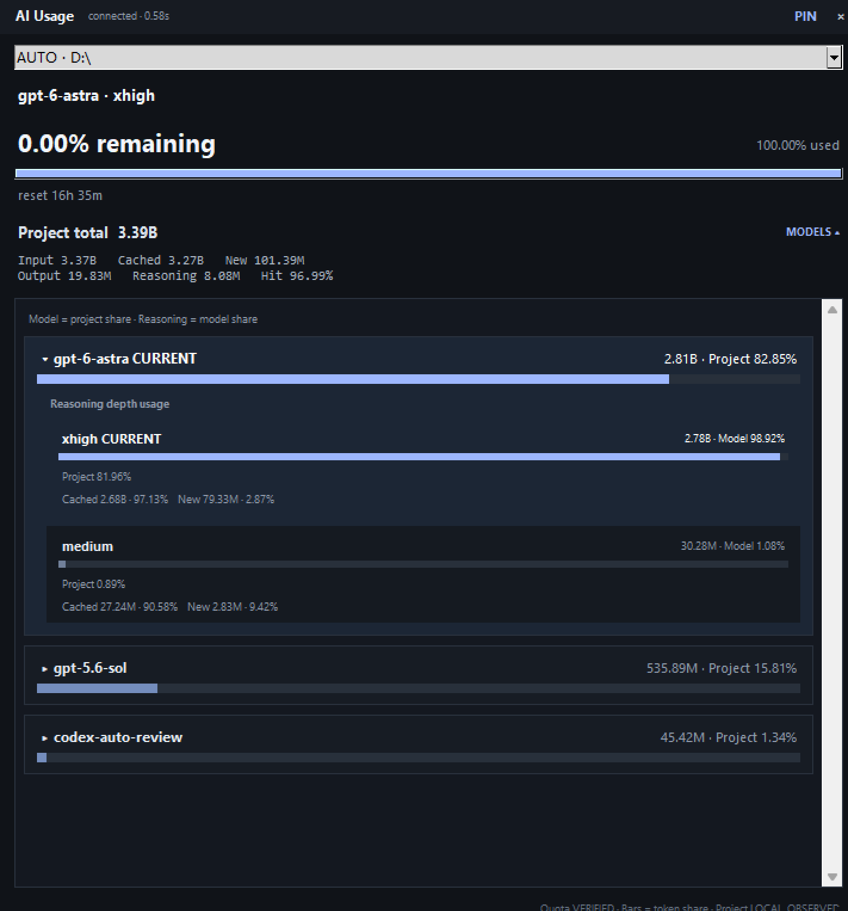

# AI Usage Monitor

[](https://github.com/lingfeijiao-oss/ai-usage-monitor/actions/workflows/build-desktop.yml)

AI Usage Monitor is a local-first desktop monitor for OpenAI Codex usage.

It combines provider-verified account quota/reset data with locally observed
project-folder token analytics, while keeping those two evidence classes
explicitly separate.

## Product preview


## Current release

**v0.3.1-rc.1** is the first public cross-platform release candidate.

[View release notes and all downloads](https://github.com/lingfeijiao-oss/ai-usage-monitor/releases/tag/v0.3.1-rc.1)

| Platform | Download |
| --- | --- |
| Windows x64 | [Installer EXE](https://github.com/lingfeijiao-oss/ai-usage-monitor/releases/download/v0.3.1-rc.1/AIUsageMonitor-Setup-Windows-x64.exe) |
| macOS Apple Silicon | [ARM64 DMG](https://github.com/lingfeijiao-oss/ai-usage-monitor/releases/download/v0.3.1-rc.1/AIUsageMonitor-macOS-arm64.dmg) |
| macOS Intel | [x64 DMG](https://github.com/lingfeijiao-oss/ai-usage-monitor/releases/download/v0.3.1-rc.1/AIUsageMonitor-macOS-x64.dmg) |
| Linux amd64 | [DEB](https://github.com/lingfeijiao-oss/ai-usage-monitor/releases/download/v0.3.1-rc.1/ai-usage-monitor_0.3.1_amd64.deb) |
| Linux amd64 portable | [tar.gz](https://github.com/lingfeijiao-oss/ai-usage-monitor/releases/download/v0.3.1-rc.1/ai-usage-monitor-linux-amd64.tar.gz) |

Each platform artifact is built on a native GitHub-hosted runner. The packaged
executable is smoke-tested before the final package is created, and every
release artifact includes a SHA-256 checksum file.

> Release-candidate note: Windows and macOS artifacts are currently unsigned,
> and macOS DMGs are not Apple-notarized yet. Operating-system trust/reputation
> warnings are therefore expected.

## What it shows

For Codex, the desktop window can show:

- official account quota state and reset time when exposed by Codex App Server;
- locally observed token totals grouped by project folder;
- input, cached input, new input, output, and reasoning-output tokens;
- cache-hit rate;
- the current locally observed model and reasoning effort;
- historical usage grouped by model and reasoning depth;
- model share of project tokens;
- reasoning-depth share of model tokens.

## Metric provenance

AI Usage Monitor deliberately separates provider evidence from local analytics.

| Label | Meaning |
| --- | --- |
| `VERIFIED` | Supplied by an official/local provider interface. |
| `LOCAL_OBSERVED` | Derived from provider telemetry stored on the local device. |
| `OBSERVED` | Directly observed but not provider-billing verified. |
| `ESTIMATED` | Calculated estimate. |
| `UNSUPPORTED` | The requested metric is unavailable. |

Codex project/model token totals are `LOCAL_OBSERVED`. They are not represented
as provider-billing totals and are not converted into provider quota
percentages without provider evidence.

## Normal use

The intended product flow is:

`Install -> Launch -> auto-detect Codex -> login if required -> monitor`

The application automatically searches for a usable local Codex installation
and Codex profiles. If an authenticated profile is not available, the official
`codex login` flow is launched.

Users do not need to select disks, start a local web server, or manage a
background collector.

Closing the visible application ends monitoring and the helper processes it
owns.

## Prerequisite

AI Usage Monitor currently requires a locally installed OpenAI Codex CLI/runtime
that exposes Codex App Server.

The monitor does not bundle a private copy of user credentials and does not
scrape browser cookies.

## Privacy

The project scanner reads local Codex rollout telemetry required for usage
accounting.

It does **not** persist:

- prompt bodies;
- model response bodies;
- source-code bodies from monitored projects;
- browser cookies.

Local account/project state is not uploaded by AI Usage Monitor.

See [PRIVACY.md](PRIVACY.md) and [SECURITY.md](SECURITY.md).

## Cross-platform release validation

The GitHub Actions release matrix currently validates:

- Windows x64;
- macOS ARM64;
- macOS Intel;
- Linux amd64.

Every target runs:

1. unit tests and release preflight checks;
2. a native PyInstaller build;
3. a smoke test against the packaged executable;
4. native package generation;
5. SHA-256 generation.

Release-candidate publishing is automated only after all target jobs pass.

## Development

Run the release preflight:

```text
python scripts/release_preflight.py
```

Run unit tests:

```text
python -m unittest discover -s tests/unit -v
```

Run the source desktop application on Windows:

```text
pwsh -File .\scripts\run_app.ps1
```

## Project status

The current provider implementation focuses on OpenAI Codex.

The provider boundary is intentionally isolated so future providers can be
implemented without changing the core project-folder accounting model.

## License

Apache License 2.0. See [LICENSE](LICENSE).

